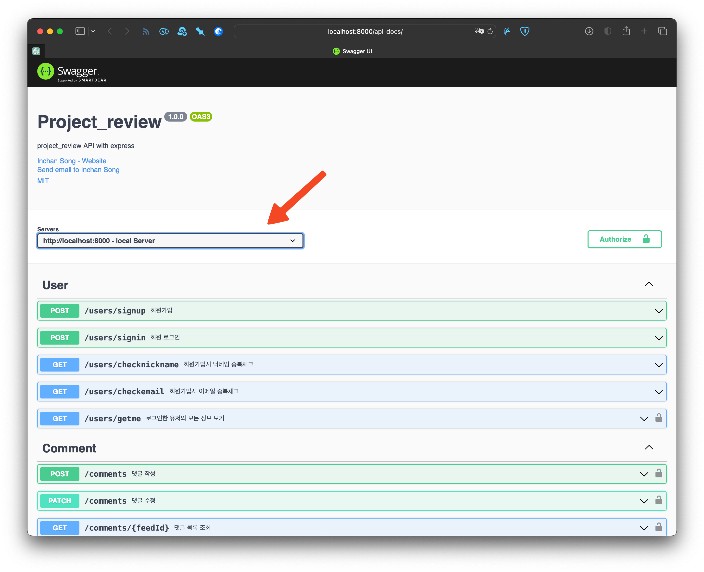
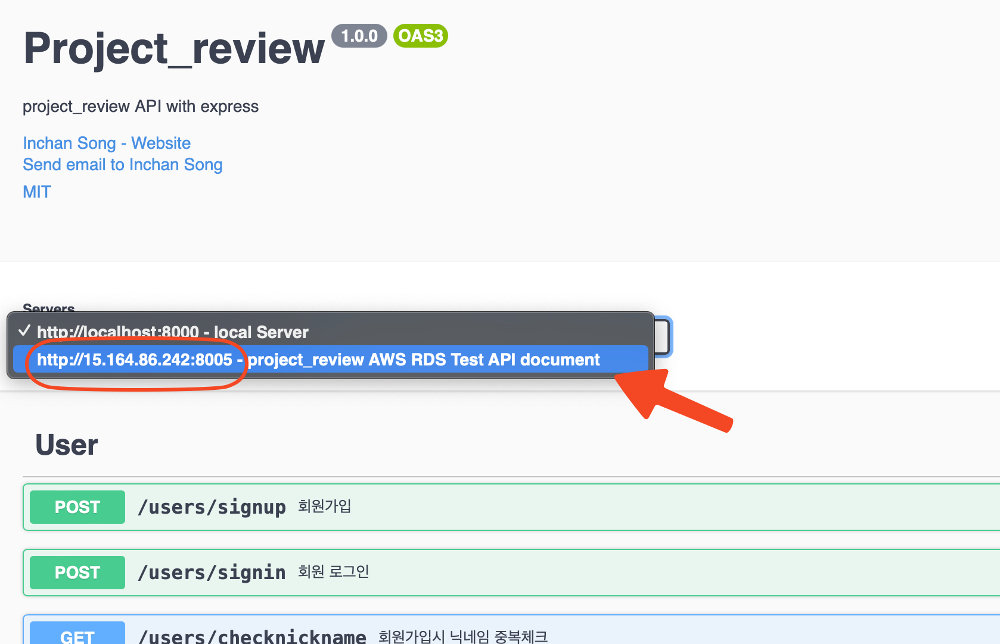

# API document for Project-review

#### Generated by: Inchan Song
#### Version: 1.0.0

---  

## Table of Contents
- [1. Introduction](#1-introduction)  
- [2. API](#2-api)  
- [3. API Reference](#3-api-reference)  
  - [3.1. User](#31-user)  
        - [3.1.1. User Sign Up](#311-user-sign-up)  
        - [3.1.2. User Sign In](#312-user-sign-in)  
        - [3.1.3. check nickname for user sign up](#313-check-nickname-for-user-sign-up)  
        - [ 3.1.4. check email for user sign up](#314-check-email-for-user-sign-up)  
  - [3.2. Comment](#32-comment)    
        - [3.2.1. Create Comment](#321-create-comment)  
        - [3.2.2. Update Comment](#322-update-comment)  
        - [3.2.3. Delete Comment](#323-read-comment)  
        - [3.2.4. Get Comment](#324-delete-comment)
  - [3.3 Category](#33-category)  
        - [3.3.1. Create Category](#331-get-category)
  - [3.4 Symbol](#34-symbol)  
        - [3.4.1. Get Symbol](#341-get-symbol)  
        - [3.4.2. Add Symbol to Feed and Update Symbol](#342-add-symbol-to-feed-and-update-symbol)  
        - [3.4.3. Get the number of Symbols per Feed](#343-get-the-number-of-symbols-per-feed)  
        - [3.4.4. Delete Symbol](#344-delete-feedsymbol)  
        - [3.4.5 Check Symbol per Feed](#345-check-symbol-per-feed)  
  - 

## 1. Introduction
이 문서는 미니프로젝트 팀의 project-review 개발간 필요한 프론트엔드용 API 문서입니다.  
이 문서는 프론트엔드 팀이 API Endpoint와 요청시 필요한 데이터 정보 및 백엔드에서 반환되는 데이터를 이해하는 데 사용할 수 있습니다.    
이 문서는 백엔드 팀에서도 API Endpoint와 백엔드로 전송되는 데이터를 이해하는 데 사용할 수 있습니다.    

## 2 API
### 2.1. API Endpoint
API endpoint는 `http://localhost:8000`을 기본으로 합니다.  
프론트엔드 팀은 이 endpoint를 사용하여 백엔드 팀이 제공하는 API를 사용할 수 있습니다.

### 2.2. How to use API
Node.js를 사용하는 `http-server`를 설치하고, `http-server`를 사용하여 API를 확인 및 테스트할 수 있습니다.
설치 방법은 다음과 같습니다.
1. 이 repository를 적당한 위치에 clone합니다.
2. `http-server`를 설치합니다. 아래 명령어를 통해 설치할 수 있습니다.
    ```bash
    $ npm install http-server -g
    ```
3. 설치가 완료되면, 다음과 같은 명령어로 API 명세서 확인 및 테스트 페이지를 호출 가능하도록 서버를 실행시킬 수 있습니다.
    ```bash
    $ http-server -p 8080 --cors
    ```
4. 페이지 호출은 2가지 방법으로 가능합니다. 
   - `http://localhost:8080`으로 접속하면 다음과 같은 화면을 볼 수 있습니다.
   - 또는 폴더내 `index.html`을 열어도 동일한 화면을 볼 수 있습니다.  
       
5. API 명세서 확인 및 테스트 페이지에서는 다음과 같은 기능을 사용할 수 있습니다.
   - API 명세서 확인
   - API 테스트
   - API 테스트 결과 확인
   - API 테스트 결과 저장
   - API 테스트 결과 로드
6. API 테스트시, 서버를 선택하여 테스트할 수 있습니다.  
    &nbsp;
     
   위 화면에서 화살표 부분을 클릭하면 다음과 같은 화면을 볼 수 있습니다.  
   &nbsp;  
     

### 2.2. API Request
API request는 `GET`, `POST`, `PUT`, `DELETE` method를 사용합니다.

### 2.3. API Response
API response는 `JSON` 형식으로 반환됩니다.

## 3. API Reference
### 3.1. User
#### 3.1.1. User Sign Up
##### description
사용자가 회원가입시 사용하는 API입니다.  
##### Request
| method | Endpoint        |  description              |
| --- |-----------------|--------------------------|
| `POST` | `/users/signup` |  사용자가 회원가입시 사용하는 API입니다. |
##### Request Body
| name | type   | require | description |
| --- |--------|------|---------------------|
| nickname | `string` | `true` | 사용자의 닉네임  |
| email | `string` | `true` | 사용자의 이메일  |
| password | `string` | `true` | 사용자의 비밀번호 |
##### Response
| 상태 코드 | description                  |
| --- |------------------------------|
| `201` | 처리가 성공적으로 이루어졌음을 나타냅니다.      |
| `500` | 내부 서버 오류가 발생하였습니다.           |

#### 3.1.2. User Sign In
##### description
사용자가 로그인시 사용하는 API입니다.
##### Request
| method | Endpoint        | description |
|--- |-----------------|------------------------------|
| `POST` | `/users/signin` | 사용자가 로그인시 사용하는 API입니다. |
##### Request Body
| name | type | require         | description |
| --- |--------|-----------------|------------|
| email | `string` | `true`            | 사용자의 이메일   |
| password | `string` | `true` | 사용자의 비밀번호  |
##### Response
| 상태 코드 | description |
| --- |------------------------------|
| `200` | 처리가 성공적으로 이루어졌음을 나타냅니다. |
| `500` | 내부 서버 오류가 발생하였습니다. |

#### 3.1.3. check nickname for user sign up
##### description
사용자가 회원가입시 닉네임 중복을 확인하는 API입니다.
##### Request
| method | Endpoint                                   | description |
|--- |--------------------------------------------|------------------------------|
| `GET` | `/users/checknickname` | 사용자가 회원가입시 닉네임 중복을 확인하는 API입니다. |
##### Request Query
| name | type | require         | description |
| --- |--------|-----------------|------------|
| nickname | `string` | `true`            | 사용자의 닉네임   |
##### Response
| 상태 코드 | description |
| --- |------------------------------|
| `200` | 처리가 성공적으로 이루어졌음을 나타냅니다. |
| `500` | 내부 서버 오류가 발생하였습니다. |

#### 3.1.4. check email for user sign up
##### description
사용자가 회원가입시 이메일 중복을 확인하는 API입니다.
##### Request
| method | Endpoint                                   | description |
|--- |--------------------------------------------|------------------------------|
| `GET` | `/users/checkemail` | 사용자가 회원가입시 이메일 중복을 확인하는 API입니다. |
##### Request Query
| name | type | require         | description |
| --- |--------|-----------------|------------|
| email | `string` | `true`            | 사용자의 이메일   |
##### Response
| 상태 코드 | description |
| --- |------------------------------|
| `200` | 처리가 성공적으로 이루어졌음을 나타냅니다. |
| `500` | 내부 서버 오류가 발생하였습니다. |

#### 3.1.5. User - get me
##### description
사용자가 자신의 정보를 조회할 때 사용하는 API입니다.
##### Request
| method | Endpoint        | description |
|--- |-----------------|------------------------------|
| `GET` | `/users/me` | 사용자가 자신의 정보를 조회할 때 사용하는 API입니다. |
#### Request Header
| name | type | require         | description |
| token | `string` | `true`            | 사용자의 토큰   |
##### Response
| 상태 코드 | description |
| --- |------------------------------|
| `200` | 처리가 성공적으로 이루어졌음을 나타냅니다. |
| `500` | 내부 서버 오류가 발생하였습니다. |

### 3.2. Comment
#### 3.2.1. Create Comment
##### description
사용자가 댓글을 작성할 때 사용하는 API입니다.  
댓글 작성시 `is_private`을 `true`로 설정하면 해당 댓글은 작성자만 볼 수 있습니다.   
댓글 작성시 `parent`를 설정하면 대댓글로 작성됩니다.  
##### Request
| method | Endpoint           | description |
|--- |--------------------|------------------------------|
| `POST` | `/api/comment` | 사용자가 댓글을 작성할 때 사용하는 API입니다. |
#### Request Header
| name | type | require         | description |
| --- |--------|-----------------|------------|
| token | `string` | `true`            | 사용자의 토큰   |

##### Request Body
| name       | type | require         | description |
|------------|--------|-----------------|------------|
| comment    | `string` | `true`            | 댓글의 내용   |
| is_private | `boolean` | `false` | 댓글의 공개 여부 - 미입력시 기본값 `false` |
| parent     | `number` | `false` | 댓글의 부모 댓글의 id - 미입력시 기본값 `null` |

##### Response
| 상태 코드 | description |
| --- |------------------------------|
| `201` | 처리가 성공적으로 이루어졌음을 나타냅니다. |
| `401` | 사용자의 토큰이 유효하지 않습니다. |
| `500` | 내부 서버 오류가 발생하였습니다. |

#### 3.2.2. Update Comment
##### description
사용자가 자신이 작성한 댓글을 수정할 때 사용하는 API입니다.
##### Request
| method  | Endpoint                | description |
|---------|-------------------------|------------------------------|
| `PATCH` | `/api/comment` | 사용자가 자신이 작성한 댓글을 수정할 때 사용하는 API입니다. |
##### Request Header
| name | type | require         | description |
| --- |--------|-----------------|------------|
| token | `string` | `true`    | 사용자의 토큰   |

##### Request Body
| name | type | require         | description |
| --- |--------|-----------------|------------|
| comment | `string` | `true`            | 댓글의 내용   |
| is_private | `boolean` | `false` | 댓글의 공개 여부 - 미입력시 기본값 `false` |
##### Response
| 상태 코드 | description |
| --- |------------------------------|
| `200` | 처리가 성공적으로 이루어졌음을 나타냅니다. |
| `401` | 사용자가 댓글을 수정할 권한이 없습니다. |
| `500` | 내부 서버 오류가 발생하였습니다. |

#### 3.2.3. Read Comment List
##### description
사용자가 게시글별 작성된 댓글들을 읽을 때 사용하는 API입니다.  
feedId에 해당하는 댓글 목록을 가져옵니다.  
댓글의 children에는 대댓글이, 대댓글의 children에는 대댓글의 대댓글이 담겨있습니다.  
  
**비공개 댓글**의 경우,    
1. 해당 댓글의 작성자  
2. 게시글의 작성자  
의 경우에만 조회할 수 있습니다.  
   
비공개 **대댓글**의 경우,  
1. 해당 대댓글의 작성자  
2. 원댓글의 작성자  
의 경우에만 조회할 수 있으며, **게시글의 작성자는 조회할 수 없습니다.**  
##### Request
| method | Endpoint                | description |
|--- |-------------------------|------------------------------|
| `GET` | `/api/comment/{feedId}` | 사용자가 댓글을 읽을 때 사용하는 API입니다. |
##### Request Header
| name | type | require         | description |
| --- |--------|-----------------|------------|
| token | `string` | `true`            | 사용자의 토큰   |
##### Request Path Parameter
| name   | type | require         | description |
|--------|--------|-----------------|------------|
| feedId | `integer` | `true`            | 게시글의 id   |
##### Response
| 상태 코드 | description |
| --- |------------------------------|
| `200` | 처리가 성공적으로 이루어졌음을 나타냅니다. |
| `500` | 내부 서버 오류가 발생하였습니다. |

#### 3.2.4. Delete Comment
##### description
사용자가 자신이 작성한 댓글을 삭제할 때 사용하는 API입니다.
##### Request
| method | Endpoint                | description |
|--- |-------------------------|------------------------------|
| `DELETE` | `/api/comment/{commentId}` | 사용자가 자신이 작성한 댓글을 삭제할 때 사용하는 API입니다. |
##### Request Header
| name | type | require         | description |
| --- | --- | ---- | -------------------------|
| token | `string` | `true` | 사용자의 토큰 |
##### Request Path Parameter
| name | type | require | description |
| --- | --- | --- | --- |
| commentId | `integer` | `true` | 댓글의 id |
##### Response
| 상태 코드 | description |
| --- | --- |
| `200` | 처리가 성공적으로 이루어졌음을 나타냅니다. |
| `401` | 사용자가 댓글을 삭제할 권한이 없습니다. |
| `500` | 내부 서버 오류가 발생하였습니다. |

### 3.3. Category
#### 3.3.1. Get Category
##### description
사용자가 카테고리를 조회할 때 사용하는 API입니다.
##### Request
| method | Endpoint          | description |
|--- |-------------------|------------------------------|
| `GET` | `/api/categories` | 사용자가 카테고리를 조회할 때 사용하는 API입니다. |
##### Response
| 상태 코드 | description |
| --- | --- |
| `200` | 처리가 성공적으로 이루어졌음을 나타냅니다. |

### 3.4. Symbol
#### 3.4.1. Get Symbol
##### description
심볼의 종류를 조회할 때 사용하는 API입니다.
##### Request
| method | Endpoint          | description |
|--- |-------------------|------------------------------|
| `GET` | `/api/symbols` | 심볼의 종류를 조회할 때 사용하는 API입니다. |
##### Response
| 상태 코드 | description |
| --- | --- |
| `200` | 처리가 성공적으로 이루어졌음을 나타냅니다. |
#### 3.4.2. Add Symbol to Feed and Update Symbol
##### description
사용자가 게시글에 심볼을 추가하거나 심볼을 수정할 때 사용하는 API입니다.
##### Request
| method | Endpoint                | description |
|--- |-------------------------|------------------------------|
| `POST` | `/api/symbols/{feedId}` | 사용자가 게시글에 심볼을 추가하거나 심볼을 수정할 때 사용하는 API입니다. |
##### Request Header
| name | type | require         | description |
| --- | --- | ---- | -------------------------|
| token | `string` | `true` | 사용자의 토큰 |
##### Request Path Parameter
| name | type | require | description |
| --- | --- | --- | --- |
| feedId | `integer` | `true` | 게시글의 id |
##### Request Body
| name | type | require | description |
| --- | --- | --- | --- |
| symbolId | `integer` | `true` | 심볼의 id |
##### Response
| 상태 코드 | description                   |
|-------|-------------------------------|
| `200` | 심볼 수정 처리가 성공적으로 이루어졌음을 나타냅니다. |
| `201` | 심볼 추가 처리가 성공적으로 이루어졌음을 나타납니다. |
| `400` | 변경사항이 없습니다.                   |
| `403` | 사용자의 게시글이므로 심볼을 추가할 권한이 없습니다. |
| `500` | 내부 서버 오류가 발생하였습니다.            |
#### 3.4.3. Get the number of Symbols per Feed
##### description
사용자가 게시글별 심볼의 개수를 조회할 때 사용하는 API입니다.
##### Request
| method | Endpoint                | description |
|--- |-------------------------|------------------------------|
| `GET` | `/api/symbols/{feedId}` | 사용자가 게시글별 심볼의 개수를 조회할 때 사용하는 API입니다. |
##### Request Path Parameter
| name | type | require | description |
| --- | --- | --- | --- |
| feedId | `integer` | `true` | 게시글의 id |
##### Response
| 상태 코드 | description                   |
|-------|-------------------------------|
| `200` | 심볼 개수 조회 처리가 성공적으로 이루어졌음을 나타냅니다. |
| `500` | 내부 서버 오류가 발생하였습니다. |
#### 3.4.4. Delete FeedSymbol
##### description
사용자가 게시글에 추가한 심볼을 삭제할 때 사용하는 API입니다.
##### Request
| method | Endpoint                | description |
|--- |-------------------------|------------------------------|
| `DELETE` | `/api/symbols/{feedId}` | 사용자가 게시글에 추가한 심볼을 삭제할 때 사용하는 API입니다. |
##### Request Header
| name | type | require         | description |
| --- | --- | ---- | -------------------------|
| token | `string` | `true` | 사용자의 토큰 |
##### Request Path Parameter
| name | type | require | description |
| --- | --- | --- | --- |
| feedId | `integer` | `true` | 게시글의 id |
##### Response
| 상태 코드 | description                   |
|-------|-------------------------------|
| `200` | 심볼 삭제 처리가 성공적으로 이루어졌음을 나타냅니다. |
| `401` | 사용자가 심볼을 삭제할 권한이 없습니다. |
| `500` | 내부 서버 오류가 발생하였습니다. |
#### 3.4.5 Check Symbol per Feed
##### description
사용자가 게시글에 심볼을 추가했는지 확인할 때 사용하는 API입니다.
##### Request
| method | Endpoint                      | description |
|--- |-------------------------------|------------------------------|
| `GET` | `/api/symbols/check/{feedId}` | 사용자가 게시글에 심볼을 추가했는지 확인할 때 사용하는 API입니다. |
##### Request Header
| name | type | require         | description |
| --- | --- | ---- | -------------------------|
| token | `string` | `true` | 사용자의 토큰 |
##### Request Path Parameter
| name | type | require | description |
| --- | --- | --- | --- |
| feedId | `integer` | `true` | 게시글의 id |
##### Response
| 상태 코드 | description                   |
|------|-------------------------------|
| `200` | 심볼 추가 여부 확인 처리가 성공적으로 이루어졌음을 나타냅니다. |
| `401` | 사용자가 심볼을 추가했는지 확인할 권한이 없습니다. |
| `500` | 내부 서버 오류가 발생하였습니다. |


