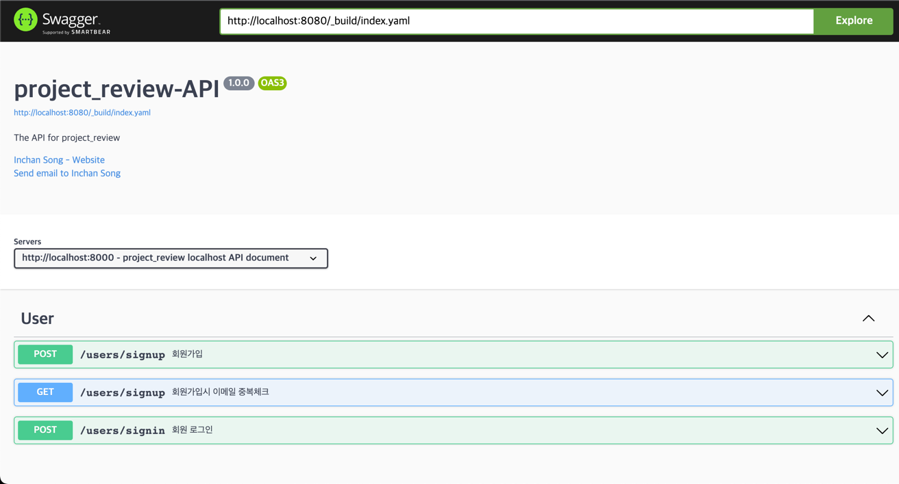

# API document for Project-review

#### Generated by: Inchan Song
#### Version: 1.0.0

---  

## Table of Contents
- [1. Introduction](#1-introduction)  
- [2. API](#2-api)  
- [3. API Reference](#3-api-reference)  
  - [3.1. User](#31-user)  
        - [3.1.1. User Sign Up](#311-user-sign-up)  
        - [3.1.2. User Sign In](#312-user-sign-in)  

## 1. Introduction
이 문서는 미니프로젝트 팀의 project-review 개발간 필요한 프론트엔드용 API 문서입니다.  
이 문서는 프론트엔드 팀이 API Endpoint와 요청시 필요한 데이터 정보 및 백엔드에서 반환되는 데이터를 이해하는 데 사용할 수 있습니다.    
이 문서는 백엔드 팀에서도 API Endpoint와 백엔드로 전송되는 데이터를 이해하는 데 사용할 수 있습니다.    

## 2 API
### 2.1. API Endpoint
API endpoint는 `http://localhost:8000`을 기본으로 합니다.  
프론트엔드 팀은 이 endpoint를 사용하여 백엔드 팀이 제공하는 API를 사용할 수 있습니다.

### 2.2. How to use API
Node.js를 사용하는 `http-server`를 설치하고, `http-server`를 사용하여 API를 테스트할 수 있습니다.
설치 방법은 다음과 같습니다.
1. 이 repository를 적당한 위치에 clone합니다.
2. `http-server`를 설치합니다. 아래 명령어를 통해 설치할 수 있습니다.
    ```bash
    $ npm install http-server -g
    ```
3. 설치가 완료되면, 다음과 같은 명령어로 API 명세서 확인 및 테스트 페이지를 호출 가능하도록 서버를 실행시킬 수 있습니다.
    ```bash
    $ http-server -p 8080 --cors
    ```
4. 페이지 호출은 2가지 방법으로 가능합니다. 
   - `http://localhost:8080`으로 접속하면 다음과 같은 화면을 볼 수 있습니다.
   - 또는 폴더내 `index.html`을 열어도 동일한 화면을 볼 수 있습니다.  
       

### 2.2. API Request
API request는 `GET`, `POST`, `PUT`, `DELETE` method를 사용합니다.

### 2.3. API Response
API response는 `JSON` 형식으로 반환됩니다.

## 3. API Reference
### 3.1. User
#### 3.1.1. User Sign Up
##### description
사용자가 회원가입시 사용하는 API입니다.  
##### Request
| method | Endpoint | require |description |
| --- | --- | --- |
| `POST` | `/api/user/signup` | 사용자가 회원가입시 사용하는 API입니다. |
##### Request Body
| name | type   | require | description |
| --- |--------|------|---------------------|
| nickname | `string` | `true` | 사용자의 닉네임  |
| email | `string` | `true` | 사용자의 이메일  |
| password | `string` | `true` | 사용자의 비밀번호 |
##### Response
| 상태 코드 | description                  |
| --- |------------------------------|
| `201` | 처리가 성공적으로 이루어졌음을 나타냅니다.      |
| `500` | 내부 서버 오류가 발생하였습니다.           |

#### 3.1.2. User Sign In
##### description
사용자가 로그인시 사용하는 API입니다.
##### Request
| method | Endpoint | description |
| --- |------------------------------|
| `POST` | `/api/user/signin` | 사용자가 로그인시 사용하는 API입니다. |
##### Request Body
| name | type | require         | description |
| --- |--------|-----------------|------------|
| email | `string` | `true`            | 사용자의 이메일   |
| password | `string` | `true` | 사용자의 비밀번호  |
##### Response
| 상태 코드 | description |
| --- |------------------------------|
| `200` | 처리가 성공적으로 이루어졌음을 나타냅니다. |
| `500` | 내부 서버 오류가 발생하였습니다. |